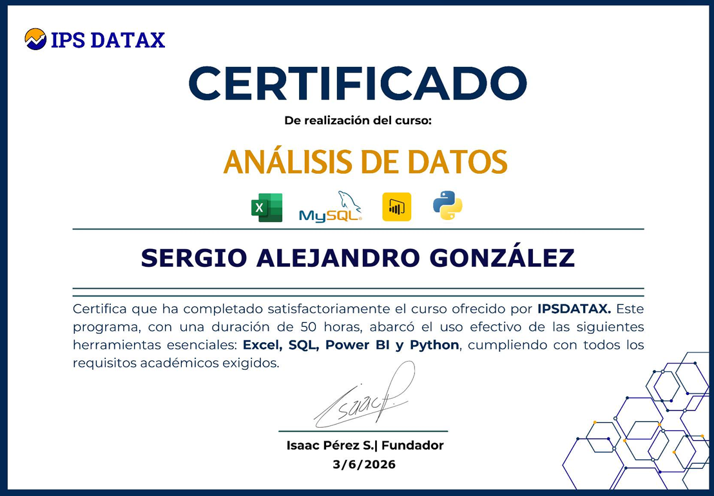

  <!-- Foto de perfil -->
  
  
  ### ¡Hola 👋, soy Alejandro!
  
  **Contador Público Nacional & Analista de Datos**

---

### 💻 Stack Tecnológico y Herramientas

  
  
  
  
  
  
  
  

---

### 📈 ¿En qué me enfoco?
* **Análisis Financiero y Contable:** Automatización de reportes, conciliaciones y procesamiento de grandes volúmenes de datos económicos.
* **Business Intelligence:** Creación de dashboards y modelos predictivos para la gestión de negocios.
* **Actualización Continua:** Integración de la tecnología al servicio de la profesión contable para no quedar atrás en la era digital.

---

### 🏆 Certificado Destacado en Análisis de Datos

  

---

### 📊 Estadísticas en GitHub

  

